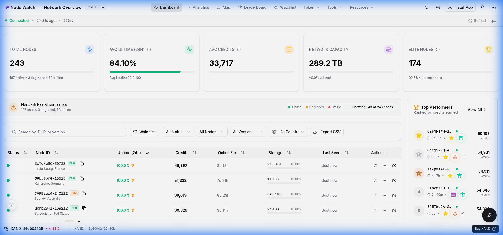
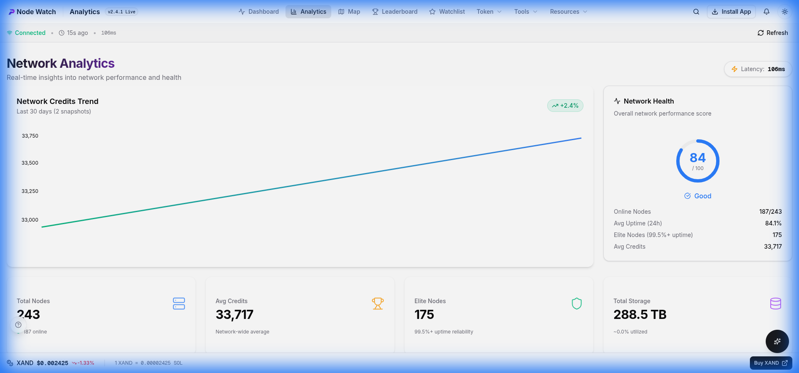
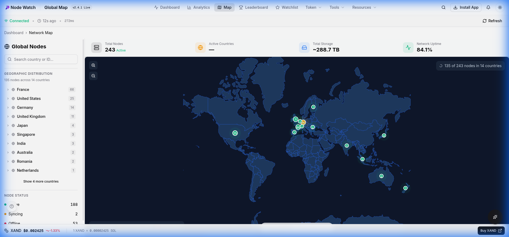
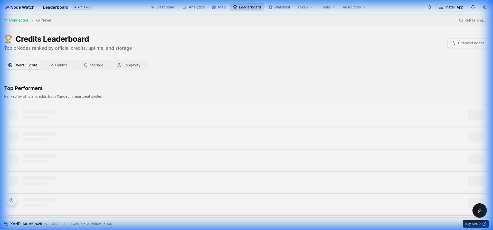
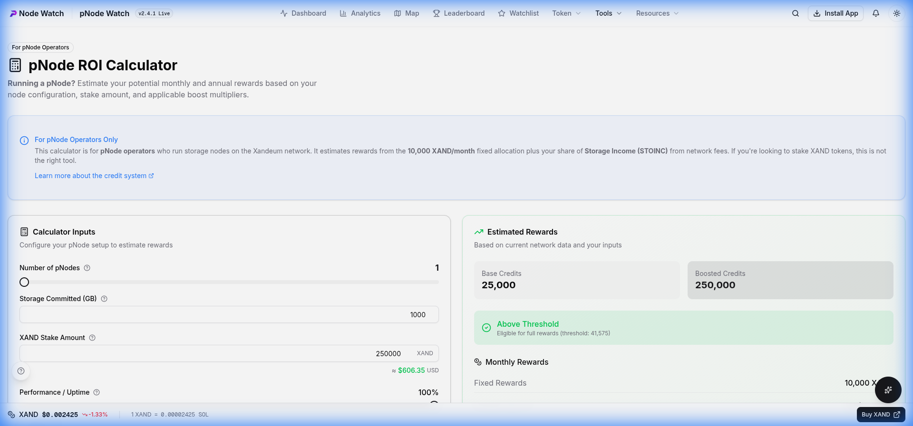
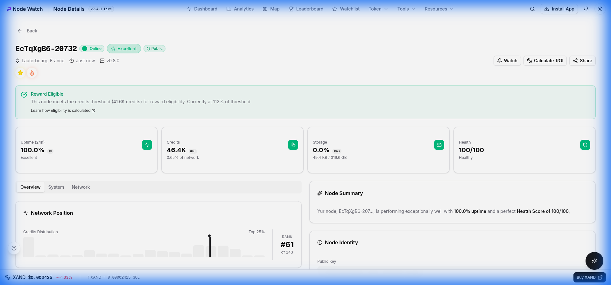
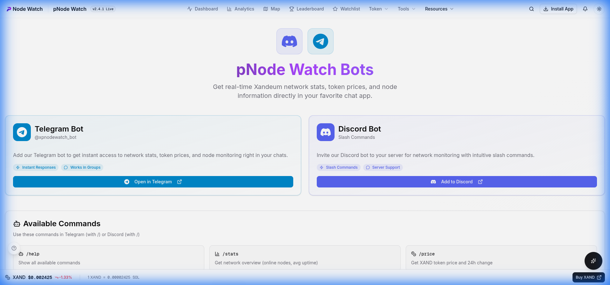

# User Guide

Welcome to the Xandeum pNode Analytics Platform! This guide explains how to use all features of the platform.

## Table of Contents

1. [Dashboard](#dashboard)
2. [Node Table](#node-table)
3. [Analytics](#analytics)
4. [Network Map](#network-map)
5. [Leaderboard](#leaderboard)
6. [Tools](#tools)
7. [Node Details](#node-details)
8. [Alerts](#alerts)
9. [Settings](#settings)
10. [Copilot Assistant](#copilot-assistant)
11. [Telegram & Discord Bots](#telegram--discord-bots)

---

## Dashboard

The dashboard is your main overview of the Xandeum pNode network.

### Network Stats

At the top of the dashboard, you'll see key metrics:

| Metric | Description |
|--------|-------------|
| **Total Nodes** | Number of registered pNodes |
| **Online Nodes** | Nodes currently active |
| **Health Score** | Overall network health (0-100) |
| **Avg Uptime** | Average uptime across all nodes |
| **Total Storage** | Combined storage committed |
| **Elite Nodes** | Nodes with 99.5%+ uptime |

### Issue Detection

The dashboard highlights network issues:

- 🔴 **Critical**: Nodes offline
- 🟡 **Warning**: Degraded performance
- 🔵 **Info**: Version updates available

---

## Node Table

The main data table displays all pNodes with sortable columns.

### Columns

| Column | Description |
|--------|-------------|
| **Status** | Online (green), Degraded (yellow), Offline (red) |
| **Node ID** | Unique identifier (first 8 characters of public key) |
| **Public/Private** | Whether node exposes public metrics |
| **Location** | Country and city (hover for details) |
| **Uptime** | Percentage uptime with reliability badge |
| **Storage** | Committed storage with utilization bar |
| **Response Time** | Latency in milliseconds |
| **Version** | Software version with type indicator |

### Filtering

Use the filter bar to narrow results:

1. **Search**: Type node ID, country, or city
2. **Status**: Filter by Online, Degraded, or Offline
3. **Access**: Filter by Public or Private nodes
4. **Version Type**: Filter by Mainnet, Trynet, or Devnet
5. **Country**: Select specific country

### Sorting

Click any column header to sort:
- Click once for ascending
- Click again for descending
- Click third time to clear sort

### Pagination

Navigate through results:
- 10, 25, or 50 nodes per page
- Use arrows or page numbers

---

## Analytics

The Analytics page provides charts and trends.

### Available Charts

1. **Network Uptime Over Time** - Line chart showing uptime trends
2. **Node Count History** - Track network growth
3. **Response Time Distribution** - Latency patterns
4. **Version Distribution** - Pie chart of software versions
5. **Geographic Distribution** - Nodes by region

### Time Range Selection

Filter charts by time range:
- **24 Hours** - Recent activity
- **7 Days** - Weekly trends
- **30 Days** - Monthly overview

### Key Metrics

- **Elite Nodes** - Count of top-tier nodes (99.5%+ uptime)

---

## Network Map

The Map page shows geographic distribution of nodes worldwide.

### Map Features

- **Zoom**: Use + / - buttons or scroll
- **Pan**: Click and drag to move
- **Markers**: Color-coded by status
  - 🟢 Green = Online
  - 🟡 Yellow = Degraded
  - 🔴 Red = Offline

### Sidebar

The left sidebar shows:

1. **Search** - Find nodes by country or ID
2. **Geographic Distribution** - Expandable list of countries
   - Click country to expand cities
   - Click city to see nodes
   - Click node to go to details
3. **Node Status** - Count of Active, Syncing, Offline

### Live Updates

The map updates automatically. The "Live Updates" indicator shows last sync time.

---

## Leaderboard

The Leaderboard ranks top-performing nodes.

### Categories

1. **Top by Uptime** - Highest availability
   - 🥇🥈🥉 medals for top 3
   - Reliability badges (Elite, Reliable, Average)

2. **Top by Response Time** - Fastest nodes
   - Lower is better
   - Measured in milliseconds

### Understanding Badges

| Badge | Uptime | Description |
|-------|--------|-------------|
| 🏆 Elite | 99.5%+ | Exceptional reliability |
| ⭐ Reliable | 95-99.5% | Good performance |
| Average | 80-95% | Acceptable |
| Unreliable | <80% | Needs improvement |

---

## Tools

The platform offers several tools for pNode operators and token holders.

### ROI Calculator

The **pNode ROI Calculator** helps operators estimate potential rewards.

- **Access**: `Tools` > `ROI Calculator`
- **Features**:
  - Estimate monthly/annual rewards based on stake and storage
  - Apply boost multipliers (Era, NFT)
  - Check eligibility against network thresholds (80% of 95th percentile)
  - View projected "Fixed Rewards" and "Storage Income" (STOINC)

### Staking Calculator

The **Stake SOL** calculator is for users who want to stake SOL for XANDSOL.

- **Access**: `Token` > `Stake SOL`
- **Features**:
  - Calculate expected XANDSOL returns
  - View current APY (approx. 15%)
  - See XANDSOL and SOL price data from Jupiter
  - Direct link to the official XandSOL staking app

### Trade XAND

Quick access to trade XAND tokens.

- **Access**: `Token` > `Trade XAND`
- **Features**:
  - View real-time XAND price and market cap
  - Integrated Jupiter terminal for swapping

---

## Node Details

Click any node ID to view detailed information.

### Overview Tab

- **Status**: Current state with last seen time
- **Reliability**: Uptime badge and percentage
- **Health Score**: Overall node health

### Technical Details

- **Public Key**: Full identifier
- **IP Address**: Network address
- **Port**: Service port
- **RPC Port**: JSON-RPC port
- **Version**: Software version with type

### Storage

- **Committed**: Total storage pledged
- **Used**: Current utilization
- **Utilization Bar**: Visual percentage

### Location

- **Country**: Geographic location
- **City**: City if available
- **Coordinates**: Latitude/Longitude

### Alert Subscription

Subscribe to alerts for this node (see [Alerts](#alerts) section).

---

## Alerts

Get notified when node status changes.

### Alert Types

| Type | Description |
|------|-------------|
| **Node Offline** | Node goes from online to offline |
| **Uptime Drop** | Uptime drops below threshold |
| **Version Change** | Node updates software version |

### Notification Methods

1. **Email** - Receive alerts via email
2. **Browser Push** - Real-time browser notifications

### Subscribing to Alerts

1. Go to a node's detail page
2. Click "Subscribe to Alerts"
3. Enter your email address
4. Select alert types
5. Enable browser notifications (optional)
6. Click "Subscribe"
7. Check your email for verification link

### Managing Subscriptions

Each alert email includes an "Unsubscribe" link to remove the subscription.

---

## Settings

### Theme Toggle

Switch between light and dark mode:
- Click the sun/moon icon in the header
- Preference is saved automatically

### Data Refresh

Data auto-refreshes every 30 seconds. You can also:
- Refresh browser to get latest data
- Click retry on error states

### Export Data

On the dashboard, use the Export button to download:
- **CSV** - Spreadsheet format
- **JSON** - Developer format

---

---

## Keyboard Shortcuts

| Shortcut | Action |
|----------|--------|
| `/` | Focus search input |
| `Esc` | Clear search / Close modal |
| `←` `→` | Navigate table pages |

---

## Interactive Tour Guide

The platform includes an interactive tour guide to help you get started.

### Starting a Tour
- **First Visit**: A "Welcome" prompt will appear automatically on your first visit to key pages.
- **Manual Start**: Click the **?** button in the bottom-left corner of any page to start the tour manually.

### Skipping Tours
- **Skip**: Click "Skip" on the welcome prompt to dismiss the tour.
- **Global Dismissal**: Skipping a tour on any page will disable auto-prompts for **all** pages. You can still access tours manually via the **?** button.

---

## Mobile App Installation (PWA)

The platform is a Progressive Web App (PWA), meaning you can install it on your phone for a native app-like experience.

### iOS (iPhone/iPad)
1. Open the dashboard in **Safari**.
2. Tap the **Share** button (square with arrow up).
3. Scroll down and tap **"Add to Home Screen"**.
4. Tap **Add**.

### Android (Chrome)
1. Open the dashboard in **Chrome**.
2. Tap the **Menu** (three dots) in the top right.
3. Tap **"Install App"** or **"Add to Home Screen"**.
4. Follow the prompts to install.

---

## Copilot Assistant

The **Xandeum Copilot** is an AI-powered assistant built directly into the dashboard.

### Features

- **Context Aware**: Knows which page you are viewing and can answer questions about specific nodes or data.
- **Real-Time Data**: Has access to live network stats, XAND price, and node status.
- **Documentation Search**: Instantly searches all documentation to answer technical questions.

### How to Use

1. Click the **Sparkles** icon (✨) in the bottom-right corner.
2. Type your question (e.g., "How do I stake?", "What is the current XAND price?", "Why is this node degraded?").
3. The Copilot will analyze your question, search relevant docs, fetch live data, and provide a concise answer.

### Capabilities

- **Explain Metrics**: Ask "What does health score mean?"
- **Troubleshoot**: Ask "Why is my node offline?"
- **Market Data**: Ask "What is the market cap?"
- **Navigation**: Ask "Where can I find the leaderboard?"

---

## Telegram & Discord Bots

Get Xandeum network stats directly in your chat apps!

### Available Bots

| Platform | Link | Commands |
|----------|------|----------|
| **Telegram** | [@xpnodewatch_bot](https://t.me/xpnodewatch_bot) | /stats, /price, /node, /top |
| **Discord** | [Add to Server](https://discord.com/api/oauth2/authorize?client_id=1452450161380032704&permissions=2048&scope=bot%20applications.commands) | /stats, /price, /node, /top |

### Bot Commands

| Command | Description |
|---------|-------------|
| `/help` | Show all available commands |
| `/stats` | Network overview (online nodes, avg uptime) |
| `/price` | XAND token price and 24h change |
| `/node <id>` | Get details for a specific node |
| `/top [n]` | Top N nodes by credits (default: 5) |

Visit the **Bots** page in the app for more details and invite links.

---

## FAQ

### Why is my node showing as "Degraded"?

A node is degraded if it hasn't communicated with seed nodes in the last 60 seconds but within the last 5 minutes. This usually resolves automatically.

### Why can't I see my node's location?

Location data comes from IP geolocation services. Private IPs or new nodes may not have location data yet.

### How often is data updated?

The platform refreshes data every 30 seconds automatically.

### What is an "Elite" node?

Nodes with 99.5% or higher uptime over the measurement period receive the Elite badge.

---

## Getting Help

- **Documentation**: Read this guide
- **Guide Page**: Visit `/guide` in the app
- **Bots**: Use our [Telegram](https://t.me/xpnodewatch_bot) or [Discord](https://discord.com/api/oauth2/authorize?client_id=1452450161380032704&permissions=2048&scope=bot%20applications.commands) bots
- **Issues**: Report bugs via GitHub Issues
